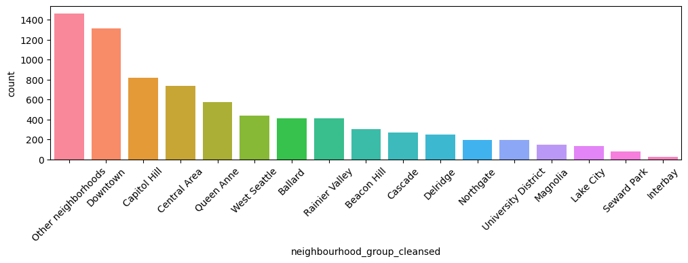
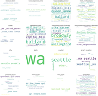
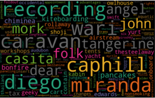
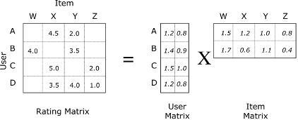
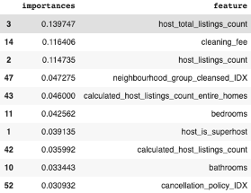
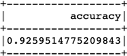
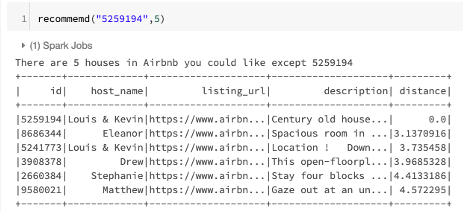

# Pricing analysis and prediction of Airbnb in Seattle
This is a project which my teammates and me did in IST 718(Big Data Analytics) at Syracuse University. 

## Project Overview:
This project is to identify the dominant factors of the house price in Airbnb. It analyzed the sentiment of guests and provided market strategies to increase the revenue for the stakeholder of Airbnb. Airbnb has become a worldwide application that people use broadly during personal or business travels for its convenience and cost-effectiveness. For this project, we have explored, made in-depth research on some public databases and decided to focus on the dataset in Seattle eventually. By analyzing the strength of the correlation between the price and various dependent variables, the insights we gained from the dataset would help us to answer the major business question: How can we help Airbnb hosts to adjust their pricing strategy to obtain the optimal gross margin and what is the overall sentiment of the users?

## Dataset Description:
This dataset consists of three parts - listings, reviews, and calendar. We will use listings and reviews in this project. The subset listing are intensively engaged in the analytic process to answer our major question - to predict price about houses by regression. Since we have a comparatively large number of attributes, first, we performed data cleaning and wrangling on a sample data. We categorized the columns by their different property(eg. Host info, Guest info, time, geography), and selected the columns related to the diverse kind of business questions. So the features can be manipulated in different ways regarding various business questions respectively.

## Data Source
The Airbnb dataset contains 106 columns and 9024 rows, which is available at http://insideairbnb.com/seattle/. This website is an independent, non-commercial set of tools and data that provide a lot of the data of Airbnb which is really being used in cities around the world. By analyzing data from this website, we can use the regression analysis to get a better price prediction. Our focus is on Seattle, since Seattle is becoming one of the prominent developing cities in the Area of North America in recent years.

## Exploration Data Analysis
### Which place is most popular？

### WordCloud

## Regression
Hosts do not always tag their house with a reasonable price based on their own experience. But Airbnb has a large volume of information about hosts and users, and we can mine the data and predict the price to create fair trade opportunities. Reasonable prices can attract more customers to use the airbnb to book their houses or apartments for their trip. Incidents may arise from time to time, like the Covid-19 this year. It is important to make the adjustment of price to cope with the market changes. This way, Airbnb can help to keep the retention rate, and even generate more for the hosts and itself.
<strong>Methods</strong>
- Lasso Regression
- Elastic Net
- Random Forest
- Gradient Boosting

## Natural Language Processing
The feedback from our customers are the first-hand materials to be analyzed. Only if hosts get an overall attitude on them, can the hosts know the direction to improve their services and strategies. A 40000 comments on Airbnb in Seattle from guests is a valuable acquisition. By analyzing the term frequency in hosts description , we may find out what are crucial elements(words) hosts can use to emprise their property to get a higher rating score. And eventually, we found out that we have positive reviews nearly 40 times more than negative ones, which means most of Airbnb has done a decent job while some of them need to be improved.

## Recommender system
In the past few years, with the rapid rise of the big data industry, companies like Amazon, Netflix, Linkedin developed advanced intelligent recommender systems. They no longer just barely take the company’s own ideas as the recommendation. For now, the system can help to direct their products to the just-right customers according to the preference of the individuals. Thus, customers can get what they indeed-needs within a key strike. In the meanwhile, companies are able to improve their services and increase sales. So the recommender system is pretty significant for a company. Through the above data analysis we know, there are a lot of people using Airbnb frequently and the most popular house was booked 795 times, so this house must have something special to attract customers. Everyone has their unique preference that shares some common with a particular group of people. Therefore it is very important and intimate to recommend similar conditions of house to users. The system can book rooms to please them as much as possible.

## Results
### Feature Importance
Using these features in the elastic net regression, we conclude that the price is more sensitive to the room's cleaning fee, which means the cleaner the room, the higher class of the houses it is. Guests tend to have a unified attitude towards the extra people. People may request a flexible arrangement, which means vouchers rewards would please a particular group of guests. This is a cost to Airbnb, but it helps to maintain the retention rate. Bed type, accommodate, bedroom and all other features indicated that comfort is a determinant for a guest to choose a house. And they could measure it by gauging the review per month.

### Regression Performance
The RMSE of the final random forest regression model is 77.654547.The R^2 of the final random forest regression model is 0.764853. we randomly split data -- 70% training data, 30% testing data. We used cross-validation and added hyperparameters to get the best model. Each time we get 9 models, they have different performances. Because the data has been splitted into 3 different folders, this way can solve overfitting or underfitting problems.
### Natural Language Processing
As what has already been stated above, sentiment analysis shows that we have positive reviews way much more than negative ones. We have 430388 positive ones and 14622 negative ones. For the prediction model, we achieved an accuracy which is 0.9259 by using a logistic model. Elastic net regularization tuning is used to tune the model, the first time accuracy with not tuning is 0.856. The first problem I met is the overfitting caused by unbalanced data since we have too many positive reviews. So I fixed this issue by randomly selecting the same number of positive labels as negative ones. Another problem is that we have too many features compared to examples ,which will also result in overfitting. For the model tuning I used L1 and L2 regularization to punish the terms that are meaningless. And use gridbuilder to select the best parameters lambda and alpha. The best of them are 0.01 and 0.2.

### Recommender System
After building this recommender system, I can recommend each user 10 houses by
using “recommendForAllUsers” which is already assembled in spark api , and 10
potential users are selected for each house by using “recommendForAllItems”. It takes
18 minutes in the training process and prediction. I use RMSE (Root Mean Square
Error) to calculate the distances between the house which users could live in and the
house I recommend to them. The result of RMSE is 0.6588.

In my second recommender system, I just need to input listing_id and how many other houses you want from the recommender system, then you can get the houses you probably like. As you can see from figure 34, this recommendation result return 5 other results, the closest distance is 3.137 and the second closest distance is 3.735, and the homeowner of this second result is Louis & Kevin who are same people as the house we want the recommender system to recommend, houses that are belonged to same people could probably be same, so the result is fairly good.

## Conclusion
To please the guest, the comfort and class of the room should be the thing that catches their eyes. And for a different member, we should have a different accommodation to meet their expectations respectively.
Overall feedback of the guests is positive, it means the hosts should keep their current service level and maybe only need to improve little. The airbnbs in Downtown and capitol hill tend to get high review scores, we can suggest people who tend to set an Airbnb start their business in these regions. Caravans Airbnb surprisingly has a high rating score, so people could own a popular Airbnb business easily if they have a caravan.
